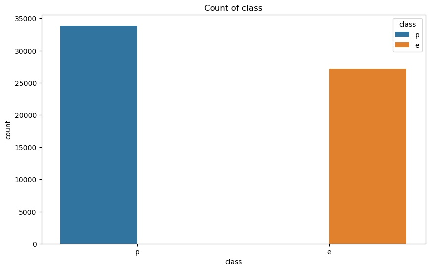
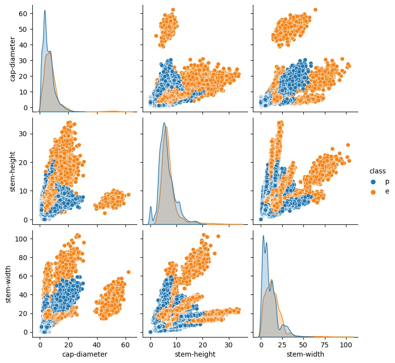
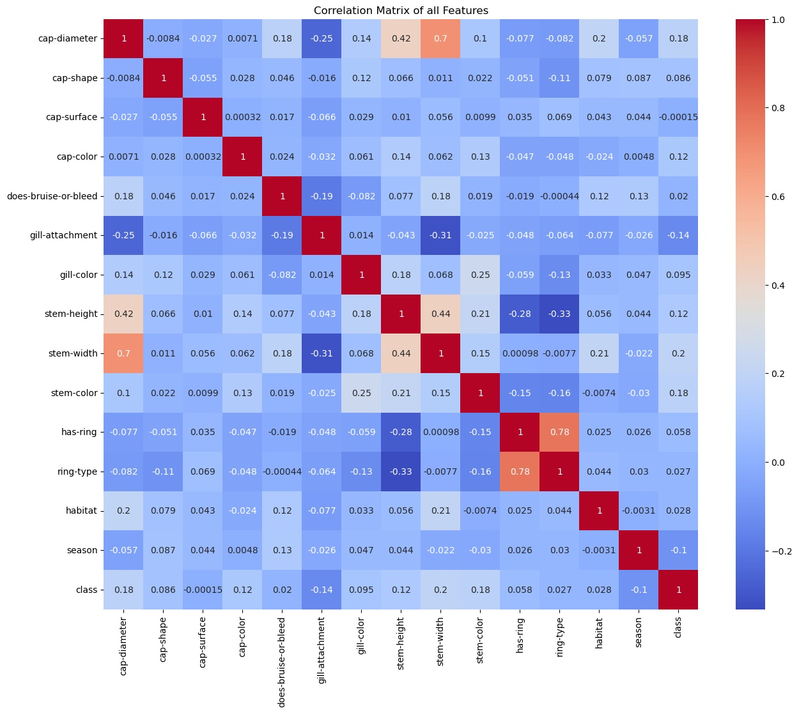
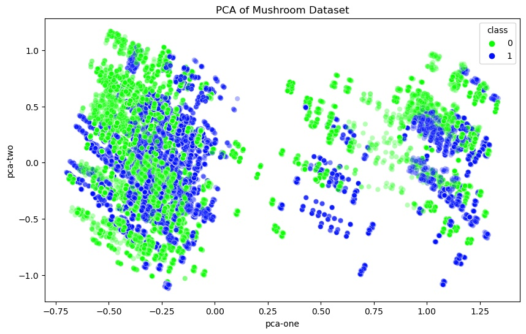
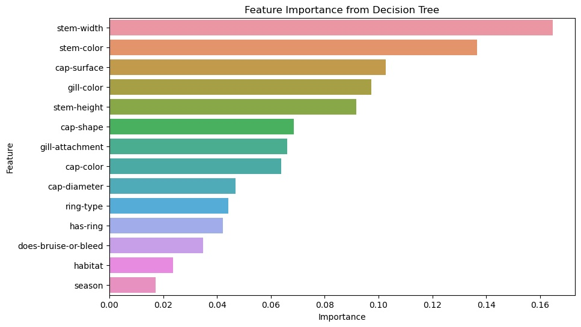

## Project Title: Classification of mushrooms using AI/ML

**Author:**

Mani K

### Executive summary
The mushroom dataset contains information about various attributes of mushrooms, such as cap-shape, cap-color, stem-width, stem-height, stem-color, cap-surface, gill-color and habitat. The research project aims to classify and identify features influencing classification of mushrooms as **poisonous** or **edible**.

### Rationale

*Classification of mushrooms as poisonous or edible is essential for multiple reasons :*

   - Crucial for preventing potentially fatal food poisoning incidents

   - Can aid in environmental conservation efforts and biodiversity studies

   - Automate the sorting of mushrooms, ensuring that only edible varieties reach the market

 *Without effective classification*
    - The process of identifying edible mushrooms remains manual, time-consuming, and prone to errors

Thorough data analysis can improve the accuracy of classification models, providing substantial benefits such as increased efficiency, risk 
mitigation and better decision-making support.

### Research Question
**Is the mushroom edible?**

The goal of this research project is to build and evaluate predictive models to classify mushroom as edible or not. 

### Data Sources
Secondary mushroom dataset from UCI machine learning repository https://archive.ics.uci.edu/dataset/848/secondary+mushroom+dataset

* **Number of Samples:** 61069
* **Number of Features:** 21

### Methodology
CRISP-DM framework is used as process guidance to achieve the goal of classifying mushrooms and identifying contributing features -

#### [Data understanding]

##### Features used for prediciton

 * **Categorical Features:** cap-shape, cap-surface, cap-color, does-bruise-or-bleed, gill-attachment, gill-spacing, gill-color, stem-root, stem-surface, stem-color, veil-type, veil-color, has-ring, ring-type, spore-print-color, habitat, season

* **Numerical Features:** cap-diameter, stem-height, stem-width

* **Target:** class

##### Data Visualization:

##### Distribution of target variable

Target class is slightly imbalanced with more poisonous types compared to edible types

###### Pair plot for numerical features

We can observe poisonous mushrooms generally tend to be of smaller stem-width, cap-diameter and stem-height.

###### Correlation matrix

- Target 'class' shows higher correlation to features like cap-diameter, stem-color, stem-height and cap-color  
- Target 'class' is negatively correlated to features like season and gill-attachment

#### [Data Preparaion]

##### Missing Data
* Dropped columns with more than 30% missing data

**Missing Percent:**
   cap-diameter             0.000000
   cap-shape                0.000000
   cap-surface             23.121387
   cap-color                0.000000
   does-bruise-or-bleed     0.000000
   gill-attachment         16.184971
   gill-spacing            41.040462
   gill-color               0.000000
   stem-height              0.000000
   stem-width               0.000000
   stem-root               84.393064
   stem-surface            62.427746
   stem-color               0.000000
   veil-color              87.861272
   has-ring                 0.000000
   ring-type                4.046243
   spore-print-color       89.595376
   habitat                  0.000000
   season                   0.000000
   class                    0.000000

* Remaining missing values were filled with the mode (most frequent value) for each column

##### Drop columns with just one type
Veil column was dropped as there is just one type.

##### Encoding
* Categorical features were identified and encoded 
   - Binary features were factorized (0 and 1) 
   - Features with more than two unique values were frequency encoded

##### Scaling
* Scale all features to ensure they are on a similar scale using MinMax scaler

#### [Modeling] 

- Following machine learning models were trained and evaluated:
     - **Baseline Model**: A dummy classifier was used to establish a baseline performance.
     - **Logistic Regression**
     - **K-Nearest Neighbors (KNN)**
     - **Support Vector Machine (SVM)**
     - **Decision Tree**
     - **Custom Logistic Regression using Gradient Decent**

#### [Evaluation/Results]

Evaluated model performance using training time, accuracy, recall and precision of training and test data.

We will use **recall score** for reccomedation as high recall ensures that most of the poisonous mushrooms are correctly identified as poisonous.

**Default Model:**

Dummy Classifier (Most Frequent) Accuracy: 0.5549369575896512

**Basic Models:**

                               Train Time  Train Accuracy  Test Accuracy  Train Recall  Test Recall  Train Precision  Test Precision
       K-Nearest Neighbors       0.099588        0.998403       0.995988      0.997379     0.993194         0.999033        0.997782
       Decision Tree             0.225074        1.000000       0.994187      1.000000     0.992642         1.000000        0.994288
       Logistic Regression       0.090166        0.642391       0.639921      0.505036     0.505151         0.620803        0.616524
       Support Vector Machine   83.843968        0.918903       0.915916      0.880708     0.880795         0.933330        0.926650

**Optimized Models:**

                              Train Time  Train Accuracy  Test Accuracy  Train Recall  Test Recall  Train Precision  Test Precision
       K-Nearest Neighbors       0.097432        1.000000       0.998117      1.000000     0.996873         1.000000        0.998894
       Decision Tree             0.267062        0.999959       0.994105      0.999908     0.993010         1.000000        0.993741
       Logistic Regression       0.217406        0.642166       0.639348      0.505082     0.504783         0.620403        0.615661
       Support Vector Machine  273.494926        0.982929       0.978385      0.974799     0.969095         0.986687        0.982103

**Custom Model (logistic regression using gradient decent):**

Custom Logistic Regression Train Accuracy: 63.34%
Custom Logistic Regression Test Accuracy: 63.06%

#### [Deployment]

The data is not well suited for linear separation as observed from different modeling results of logistic regression and PCA visualization after reducing to two dimensions.

The **Decision Tree** model, after hyperparameter tuning, showed the best balance between simplicity, interpretability, and performance with a recall of 99.30% on test data. This model can help identify if mushroom is edible or not.

- **Feature importance from decision Tree**
We can observe **stem-width, stem-color, cap-surface, gill-color and stem-height** are most important features identified by decision tree classifier

* Once deployment the system can be monitored for performance and make necessary adjustments as needed.

### Next steps
To further improve the model:
- Explore more advanced feature engineering techniques.
- Utilize ensemble methods like Random Forest or Gradient Boosting.
- Regularly update the model with new data to maintain its accuracy.

### Outline of project

- (Capstone.ipynb - Contains the solution sumbission) 

#### Contact and Further Information
Original research paper associated with the data set can be found at https://www.nature.com/articles/s41598-021-87602-3.pdf.
For questions and contributions please reach out using contact information from profile page.
